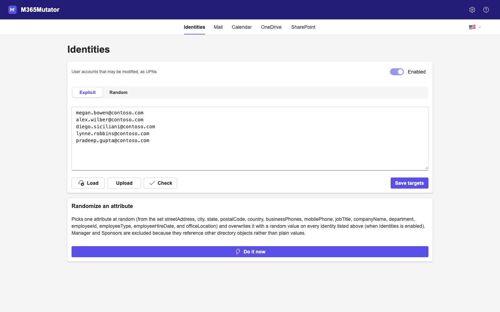
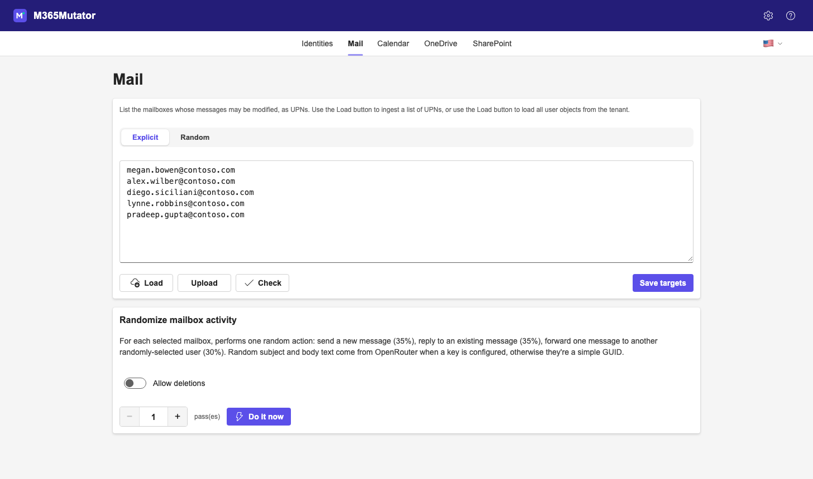
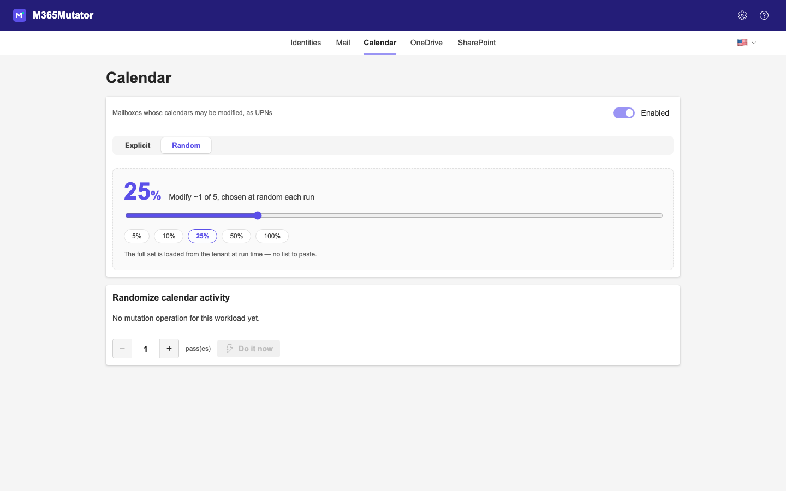
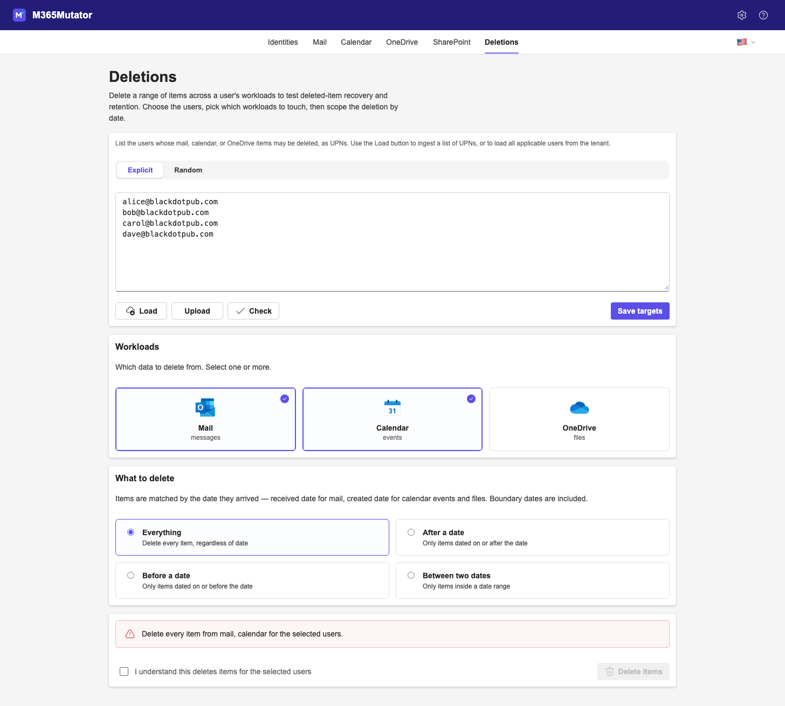

# M365Mutator

One common problem people face when working on applications, services, and scripts for Microsoft 365 is data quality or what you might call "freshness". Many demos, applications, and services depend on having updated data to work with. For example, a backup application won't be very impressive if no data has changed since the last backup was completed!

If you use your own paid tenant, refreshing data means a) that maybe you're testing in prod, which is not great and b) you may not have a large amount or a varied set of data.

If you use a Microsoft CDX tenant, the data doesn't change once the tenant's instantiated so if you want to do anything that depends on tenant activity, you can't unless you go in and add files, send email, etc. by hand. Sad!

Thus this tool: *m365mutator*. It's a web-based console that logs into a Microsoft 365 tenant via Microsoft Graph
and makes changes to user account objects in Entra, sends and receives mail and calendar items, and does CRUD operations on SharePoint and OneDrive files. It can also bulk-delete a date-scoped range of mail, calendar, and OneDrive items so you can exercise deleted-item recovery and retention.

## A bit of a warning

This application requires write permissions on Graph. It's meant, for now, to be run locally. Be careful with it; don't host it on the Internet, for crying out loud.

## Screenshots

The admin console has one tab per workload. Each tab chooses its targets
either as an **explicit list** you paste or load, or a **random percentage**
of the tenant sampled at run time — then runs that workload's mutation. In
explicit mode you create the list, edit it to taste, and then click **Save targets**. That way you can be confident that the tool isn't going to do anything until you've approved the list of items to be changed. The **Do it now** action stays
disabled until targets are loaded and saved (random mode samples the tenant
live, so it's always ready).

**Identities** — paste or load user UPNs, then randomize an Entra ID attribute
across them:



**Mail** — generate mailbox activity (send / reply / forward / move to Deleted
Items), repeatable for N passes via the stepper:



**Random run style** — instead of a list, operate on a random percentage of
the tenant, resolved when you run:



**Deletions** — select users and workloads (Mail / Calendar / OneDrive), then
delete a date-scoped range of items — everything, or before / after / between
dates — to test deleted-item recovery. Deletions are soft (recoverable) and
gated behind an explicit acknowledgement:



## Setup

1. Create the Entra ID app registration and grant it the Graph permissions you
   need — see [Entra ID app registration](#entra-id-app-registration) below.
2. Copy `.env.example` to `.env` and fill in `GRAPH_CLIENT_ID`, `GRAPH_TENANT_ID`,
   and either `GRAPH_CLIENT_SECRET` or `GRAPH_CERTIFICATE_PATH`.
3. Install dependencies and run:

   ```bash
   npm install
   npm run dev
   ```

   The admin UI loads to the Identities tab at `http://localhost:3700/admin`
   in production builds; during frontend development run
   `npm --prefix src/admin/client run dev` separately for hot reload (proxies
   `/api` to port 3700).

## Entra ID app registration

M365Mutator signs in to Microsoft Graph as an application (app-only,
client-credentials flow) — there is no interactive user. You register one
Entra ID app in the target tenant, grant it admin-consented **application**
permissions for the workloads you want to mutate, and give it a client secret
or certificate.

> **Warning:** these are tenant-wide, high-privilege permissions —
> `User.ReadWrite.All` lets the app change any user in the tenant. Grant only
> the permissions for the tabs you will actually use, and protect the client
> secret or certificate like a root credential.

### Automated setup with PowerShell (optional)

This is a shortcut, not a requirement — if you'd rather click through the
portal, skip this and follow the manual steps below, which do exactly the same
thing.

If you have the [Microsoft Graph PowerShell SDK](https://learn.microsoft.com/powershell/microsoftgraph/installation)
installed, `helpers/Create-MutatorAppReg.ps1` does steps 1–3 for you: it signs
you in interactively, creates the app registration, attaches the workload
permissions from the table below, adds a credential, and — with `-GrantConsent`
— grants admin consent. It prints the tenant ID, client ID, and the credential
at the end.

By default the credential is a client secret. If your tenant's app-management
policy blocks secrets (`CredentialTypeNotAllowedAsPerAppPolicy`), or you pass
`-UseCertificate`, the script instead generates a self-signed certificate,
uploads its public key, and writes a PEM (certificate + private key) for
`GRAPH_CERTIFICATE_PATH` — protect that file and don't commit it. The
certificate path requires PowerShell 7+.

Install the SDK once:

```powershell
Install-Module Microsoft.Graph -Scope CurrentUser
```

Then run the script from a PowerShell 5.1+ or PowerShell 7 prompt:

```powershell
# Every workload; you grant admin consent yourself afterwards
./helpers/Create-MutatorAppReg.ps1

# Only some workloads, and grant admin consent automatically (run as an admin)
./helpers/Create-MutatorAppReg.ps1 -Workloads Identities,Mail -GrantConsent

# Force a certificate credential (needed when the tenant blocks client secrets)
./helpers/Create-MutatorAppReg.ps1 -UseCertificate
```

Parameters: `-Name` (alias `-DisplayName`, default `M365Mutator`), `-Workloads` (default: all;
any of Identities, Mail, Calendar, OneDrive, SharePoint), `-SecretValidityMonths`
(default 6, also used as the certificate lifetime), `-GrantConsent`,
`-UseCertificate`, and `-CertificateOutputPath` (default `./<DisplayName>.pem`).
You still sign in as an account that can register apps — and grant admin consent,
if you pass `-GrantConsent`. Take the printed values to
[step 4](#4-supply-the-values-to-m365mutator), or paste them straight into the
admin UI's **Settings** panel.

### Manual setup

#### 1. Create the registration

1. Sign in to the [Microsoft Entra admin center](https://entra.microsoft.com)
   with an account that can register apps and grant admin consent (Global
   Administrator, or Cloud Application Administrator plus Privileged Role
   Administrator).
2. Go to **Identity → Applications → App registrations → New registration**.
3. Give it a name, e.g. `M365Mutator`.
4. Under **Supported account types**, choose **Accounts in this organizational
   directory only** (single tenant).
5. Leave **Redirect URI** empty — app-only authentication needs no redirect.
6. Select **Register**.
7. On the **Overview** page, copy the **Application (client) ID** and
   **Directory (tenant) ID**; these are `GRAPH_CLIENT_ID` and `GRAPH_TENANT_ID`.

#### 2. Add application permissions

Go to **API permissions → Add a permission → Microsoft Graph → Application
permissions** and add the permissions for the workloads you plan to use:

| Tab / workload | Graph application permission                  |
| -------------- | --------------------------------------------- |
| Identities     | `User.ReadWrite.All`                          |
| Mail           | `Mail.ReadWrite`, `Mail.Send`                 |
| Calendar       | `Calendars.ReadWrite`, `MailboxSettings.Read` |
| OneDrive       | `Files.ReadWrite.All`                         |
| SharePoint     | `Sites.ReadWrite.All`                         |

The **Deletions** tab reuses these same permissions — `Mail.ReadWrite`,
`Calendars.ReadWrite`, and/or `Files.ReadWrite.All` — for whichever of Mail,
Calendar, and OneDrive you delete from.

Each `*.ReadWrite.*` permission includes read access, so the **Load** and
**Check** buttons work without adding the read-only variants separately.

For the Calendar workload, `Calendars.ReadWrite` is required — it creates the
meeting requests and appointments. `MailboxSettings.Read` is optional: it lets
each event land inside the target user's real working hours. Without it the
workload still runs, falling back to a default Mon–Fri 08:00–17:00 window.

Then select **Grant admin consent for \<tenant\>** and confirm — the Status
column should show a green check for every permission. Without consent, Graph
calls fail with `Authorization_RequestDenied`.

#### 3. Add a credential

Use **either** a client secret **or** a certificate. If you're using a CDX tenant or a tenant that has the baseline
security policy applied, you won't be able to create a client secret. There should be an infobar in the **Certificates and secrets** page that tells you so.

Client secret (simplest):

1. Go to **Certificates & secrets → Client secrets → New client secret**.
2. Set a description and expiry, then **Add**.
3. Copy the secret **Value** immediately — it is shown only once. This is
   `GRAPH_CLIENT_SECRET`.

Certificate (recommended for production):

1. Upload the certificate's public key under **Certificates & secrets →
   Certificates → Upload certificate**.
2. Point `GRAPH_CERTIFICATE_PATH` at a local PEM file holding the certificate
   **and** its private key. Set `GRAPH_CERTIFICATE_PASSWORD` if the PEM is
   encrypted, and `GRAPH_SEND_CERTIFICATE_CHAIN=true` if your tenant requires
   subject name + issuer (SNI) authentication.

#### 4. Supply the values to M365Mutator

Put the values into `.env` (see `.env.example`) or enter them in the admin
UI's **Settings** panel, which can verify them against Graph before saving:

```dotenv
GRAPH_CLIENT_ID=<Application (client) ID>
GRAPH_TENANT_ID=<Directory (tenant) ID>
GRAPH_CLIENT_SECRET=<client secret value>   # or set GRAPH_CERTIFICATE_PATH
```

## Application structure

- `src/main.ts` — Express server entry point; serves the admin API and the
  built React client.
- `src/admin/` — the admin API and its Vite/React client (under
  `src/admin/client/`):
  - `admin-routes.ts` — REST endpoints for config, the Graph connectivity test,
    targets, and the per-workload mutations.
  - `config-store.ts` — persisted app config (Graph credentials, OpenRouter
    key/model).
  - `targets-store.ts` — each workload's target list and explicit/random run
    style.
  - `target-load.ts` / `target-check.ts` — load matching objects from the
    tenant, validate targets, and resolve the effective set (the explicit list,
    or a random sample).
  - `identity-mutate.ts` / `mail-mutate.ts` / `calendar-mutate.ts` /
    `deletion-mutate.ts` — the mutation operations for the Identities, Mail, and
    Calendar workloads, and the date-scoped Deletions across Mail/Calendar/OneDrive.
  - `random-text.ts` — random subject/body text via OpenRouter, with a GUID
    fallback when no key is set.
- `src/admin/client/` — the React admin console (Fluent UI, i18n en/de/fr/nl/uk):
  one page per workload (Identities, Mail, Calendar, OneDrive, SharePoint) plus
  Deletions, a shared `TargetPanel`, the run-count `RunStepper`, and Settings/Help
  flyouts.
- `src/graph/` — Microsoft Graph authentication (`graph-auth.ts`, client secret
  or certificate) and per-area helpers (`users.ts`, `mail.ts`, `calendar.ts`,
  `files.ts`, `sites.ts`) plus pagination.
- `src/helpers/` and `src/logger/` — shared config/file-I/O helpers and logging.
